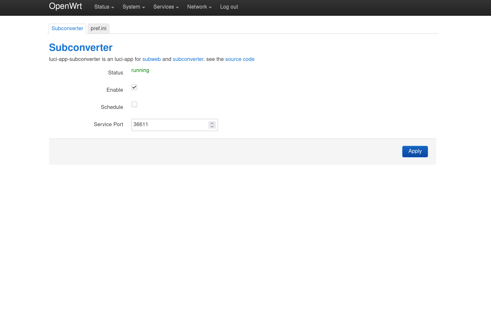
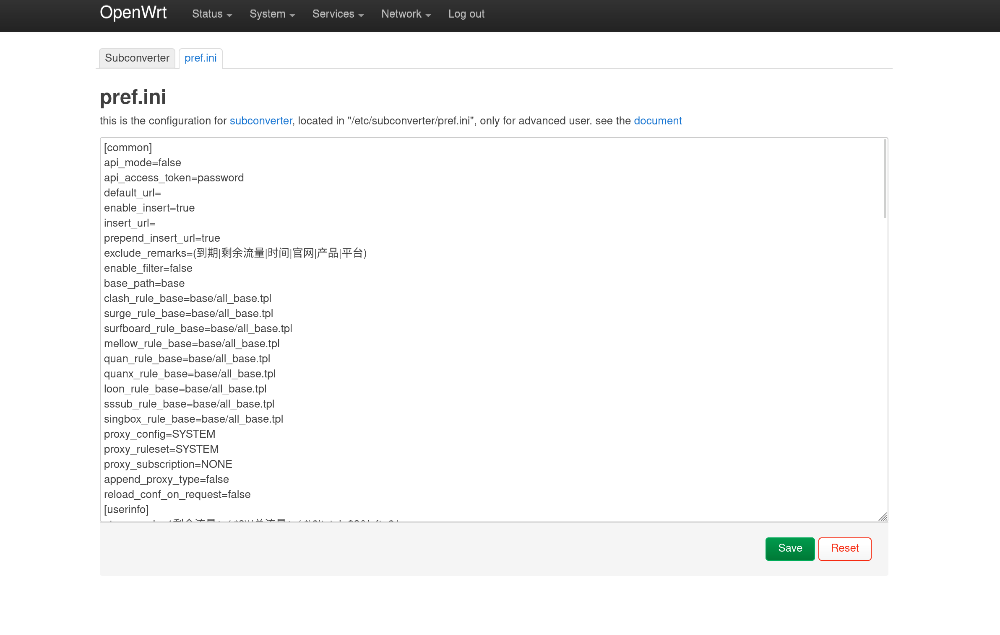
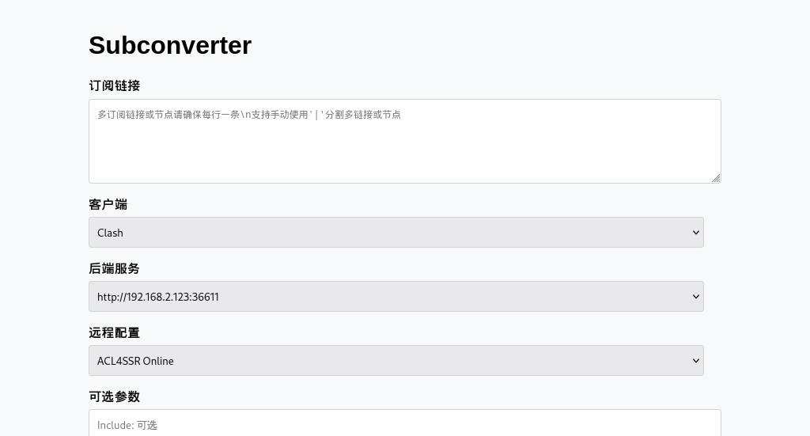

# luci-app-subconverter

a control panel for subweb and subconverter

## Based On

- [Subweb](https://github.com/stilleshan/subweb)
- [Subconverter (v1.3 and below)](https://github.com/tindy2013/subconverter)
- [asdlokj1qpi233/subconverter (v1.4+ to support vless)](https://github.com/asdlokj1qpi233/subconverter)

# Screenshot





## Features

- Supports amd64 and arm64 devices
- Tested on official OpenWRT 24.10/25.12 and LEDE R23.4.1

## System Requirements

- Disk space: 2.4MB
- Memory: 256MB

## Install
Upload the `luci-app-subconverter` package at System -> Software -> Upload Package...

```bash
# ipk
opkg install /tmp/upload.ipk
```
```bash
# apk
apk add --allow-untrusted /tmp/upload.apk
```
<br>

## Generate compressed `subconverter` binary from trusted sources

[UPX 4.2.4](https://github.com/upx/upx/releases/tag/v4.2.4)
<br>
[asdlokj1qpi233/subconverter](https://github.com/asdlokj1qpi233/subconverter/actions/runs/29073437883)

```bash
./upx --ultra-brute ./subconverter
```
<br>
